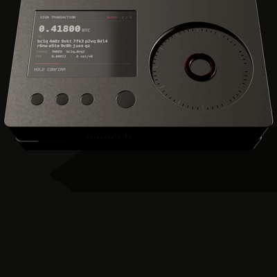
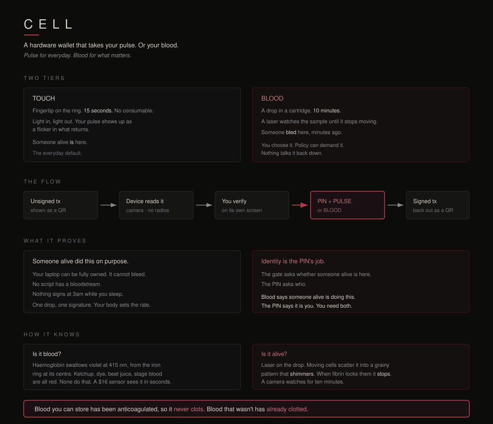
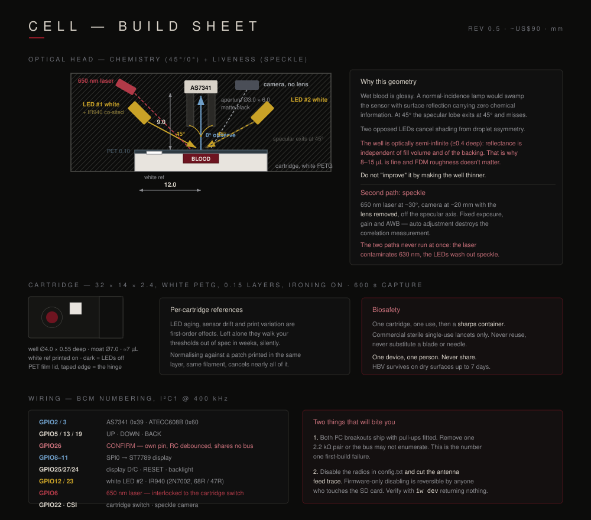

# CELL

A hardware wallet that requires a live pulse, or a drop of fresh blood, to authorise a transaction.

Airgapped signer for Bitcoin and Ethereum. Raspberry Pi, 3D-printed enclosure, about $90 in parts. Public domain.



<sup>116.2 × 73.2 × 28.3 mm. The ring is the sensor port — a fingertip on it, or a cartridge under it. It is a bezel, not a control; nothing rotates.</sup>

**Spin it yourself.** The enclosure is a parametric three.js model, not a static render:

```bash
python3 -m http.server -d viewer 8000     # then open localhost:8000/instrument.html
```

Orbit it, and export OBJ or glTF straight from the viewer. The turntable above is rendered from that same model by `tools/render_turntable.py`, so it cannot show something the geometry does not. `models/README.md` documents the pipeline and the coordinate convention.

## Status

**Rev 0.6.** The design is complete, the gate logic self-tests on every commit, and the blood reader is buildable today for about $60.

Sensing thresholds ship as physics-derived defaults and are calibrated to your hardware on first build — `calibrate.py` runs the spoof panel, sets every threshold from your own samples, and writes a file the device loads. `BUILD.md` §13 is the procedure. `VALIDATION.md` tracks exactly what has been measured.

Build it in two phases. Phase 1 is the blood reader alone, $60 and a weekend, and it proves the sensing before you spend anything on the wallet half. Read `SAFETY.md` first.

## What it does



Transactions arrive as a QR code read by the camera and leave as a QR code on the display. There is no wifi, no bluetooth and no USB data path.

Authorisation requires a PIN plus one of two liveness proofs.

| | Touch | Blood |
|---|---|---|
| Action | Fingertip on the ring | A drop in a disposable cartridge |
| Duration | 15 seconds | 10 minutes |
| Consumable | None | Cartridge and lancet |
| Proves | A living body is present | A living body bled, just now |

Touch is the everyday default. Blood is a mode the user enters deliberately.

## Why a physical act

A button press costs nothing, so malware, an automated script and a deliberate human decision all produce an identical signal. A physical act that is rate-limited by the body separates them: one drop of blood is one signature, and no amount of capital compresses that.

Sealing an agreement in blood is not a novelty. The practice appears across cultures that had no contact with each other, for the same reason each time. A mark anyone can make proves nothing; a mark that costs something proves intent.

## The blood gate

Six gates, all of which must pass. Implementation in `firmware/blood_gate.py`, with every threshold in a single dataclass.

### Chemistry: is it blood

Haemoglobin absorbs strongly at 415 nm, the Soret band produced by the iron-bearing porphyrin ring at the centre of the molecule. The absorption is roughly an order of magnitude stronger than anything else in the visible spectrum, and no common red substance produces it. Ketchup, food dye, beet juice and theatrical blood all fail this test immediately.

Three further gates confirm that the sample returns light at all, that it scatters in the near infrared the way a suspension of cells does rather than a dye solution, and that the full eight-channel spectrum matches oxygenated whole blood.

### Motion: is it alive

A stored sample fails for a reason that cannot be engineered around. Blood that can be stored has been anticoagulated and will not clot. Blood that was not anticoagulated has already clotted and cannot be poured into a well.

The device tests for this by measuring motion rather than colour. Under laser illumination, a liquid suspension of red cells produces a speckle pattern that changes continuously as the cells move. As fibrin forms it locks the cells in place and the pattern becomes static. A camera samples the pattern for ten minutes and measures the frame-to-frame correlation.

Fresh blood is the only sample that starts decorrelated and becomes correlated. Anticoagulated blood never arrests. Clotted blood, corn syrup and gels never moved in the first place. Dye produces no speckle at all.

The test assumes no particular curve shape. It asks three things: whether the sample started moving freely, whether it stopped, and whether the transition was large enough and in the right direction.

## The touch tier

Photoplethysmography through the same ring bore the cartridge sits under. Arterial blood volume in the fingertip changes with each heartbeat, so the light returning from it carries a small pulsatile signal on a large steady one. The white LED provides a red channel and the 940 nm LED provides infrared, both sampled at 50 Hz by the existing spectrometer. No additional hardware is required.

Seven gates check that the capture rate was high enough to analyse at all, that a finger is in contact, that the signal is pulsatile at a physiological depth, that the rate falls between 40 and 180 bpm, that the cardiac band dominates, that beat-to-beat variability is present, and that the red-to-infrared ratio matches haemoglobin.

The last two carry most of the anti-spoof weight. A silicone finger with dye pumped through it can produce a convincing pulse, but dye does not share haemoglobin's absorption ratio across the two wavelengths. And respiratory sinus arrhythmia puts a resting adult's beat-to-beat variability in the tens of milliseconds, where a mechanical pulsator produces single digits.

Implementation in `firmware/touch_gate.py`.

## Tier policy

The user may always escalate to a higher tier than policy requires. The user may never proceed at a lower one.

Policy sets a floor, and changing that floor is itself blood-locked in both directions. Without this rule the attack is not defeating the blood gate but lowering the threshold and using a finger. Loosening must cost blood for that reason; tightening must cost blood so that an attacker cannot lock the owner out by raising the floor.

Escalation applies to a single operation and does not persist. Running permanently at blood tier is not a separate mode, only a policy with the amount threshold set to zero and every operation class locked.

Five operations are blood-locked at provisioning and cannot be unlocked: policy changes, key export, device wipe, reprovisioning, and changes to the recipient allowlist.

Implementation in `firmware/policy.py`.

## Attestation

A signature carries no information about what gated the key, so the tier is asserted separately. Each device holds an attestation key generated at provisioning, and signs a 174-byte record binding the tier to a specific sighash, a monotonic counter and a firmware hash.

Co-signers register each other's attestation keys once. After that, verifying that every member of a quorum signed at blood tier is a mechanical check, and a missing attestation counts as a failure rather than an abstention.

The record travels beside the PSBT in a BIP-174 proprietary field and is stripped before broadcast, so it does not appear on chain.

The record attests that a device holding this key ran the blood gate for this transaction. As with a TPM quote or a Secure Enclave receipt, that claim rests on the firmware and the tamper seal — so co-signers register firmware hashes alongside keys, and `verify()` refuses builds it does not recognise.

Implementation in `firmware/attest.py`.

## What it protects against

The device defeats remote malware, automated signing, signing at scale, and signing without the owner's knowledge. A compromised host cannot produce a pulse or a clotting sample, and there is no batch mode — every signature costs a physical act by a living body, and the blood tier costs one that the body itself rate-limits.

Liveness and identity are separate jobs, and the device does both with separate mechanisms. The gate proves a living human is present. The PIN, backed by the ATECC608B's monotonic attempt counter, proves it is *you* — and it is required at both tiers.

`BUILD.md` §16 carries the full threat model.

## Keys and backup

The device holds a standard BIP39 seed, encrypted at rest and unwrapped only after the gate passes. Back it up on paper or steel as with any hardware wallet. If the device fails, restore to a Ledger, a Trezor or a replacement build.

Both Bitcoin and Ethereum use secp256k1, so one key and one signing core serve both chains.

The device signs a closed set of operations that it can render as readable text and refuses everything else, including arbitrary EVM calldata.

## Quick start

The gate logic runs without hardware.

```bash
pip install -r firmware/requirements.txt
python firmware/run_tests.py           # everything below, in one run
```

Or individually:

```bash
cd firmware
python calibrate.py selftest --n 8     # blood tier, 6 gates, 16 sample classes
python touch_gate.py                   # touch tier, 7 gates
python policy.py                       # tier rules
python attest.py                       # attestation, quorum, malformed input
```

Each spoof class fails at the physically correct gate, and the self-test fails
if any gate stops being exercised by at least one class.

The `edta` row is the interesting one: anticoagulated tube blood is chemically identical to fresh blood and passes every colour test, then fails at motion arrested because it never clots. This is the claim the whole design rests on, and it is the one an attacker cannot engineer around — blood you can store has been anticoagulated and never clots; blood that was not anticoagulated has already clotted and cannot be poured into a well.

## Repository layout

| Path | Contents |
|---|---|
| `BUILD.md` | Hardware specification: parts, wiring, optics, cartridge, firmware, calibration |
| `BOM.csv` | Bill of materials with sourcing notes |
| `firmware/blood_gate.py` | Blood tier, six gates |
| `firmware/touch_gate.py` | Touch tier, six gates |
| `firmware/ops.py` | The closed operation set and its renderer |
| `firmware/signer.py` | The unlock chain: policy, confirm, PIN, gate, sign, attest |
| `firmware/se.py` | Secure element interface and a software stub for tests |
| `firmware/policy.py` | Tier selection and escalation rules |
| `firmware/attest.py` | Tier attestation and quorum verification |
| `firmware/calibrate.py` | Spoof-panel harness and synthetic self-test |
| `firmware/hardware.py` | Sensor drivers. Untested; includes a bring-up checklist |
| `models/` | Enclosure mesh, coordinate convention, regeneration |
| `diagrams/` | Explainer, build sheet, dimensioned drawings |
| `firmware/run_tests.py` | Every self-test in one run. What CI runs |
| `tools/export_model.py` | Re-exports `instrument.obj` from `viewer/model.js` |
| `tools/render_turntable.py` | Renders the turntable GIF/MP4 from the same model |
| `tools/gen_mechanical.py` | Regenerates `diagrams/mechanical.svg` from the mesh |
| `viewer/` | Parametric three.js model — the source `instrument.obj` is exported from |
| `VALIDATION.md` | Verification status: what is tested, by what method |
| `SAFETY.md` | Blood-contact handling. Two minutes, read it first |
| `CONTRIBUTING.md` | What this project actually needs |

## Building one



`BUILD.md` §2 splits the build in two. Phase 1 is the blood reader alone at about $60: a Pi, a spectrometer, a laser, a camera, a printed chamber and cartridges. It has no security requirements because it signs nothing, and it answers the only question that determines whether the rest is worth building. Phase 2 adds the wallet for a further $30.

## Safety

Read `SAFETY.md` before the first build. In summary: use commercial sterile single-use lancets, dispose of each cartridge and lancet in a sharps container, and never share a device between people. Anyone taking anticoagulants cannot use the blood tier, because their blood will not clot and the gate will reject every sample.

## Licence

CC0 1.0. See `LICENSE`.
